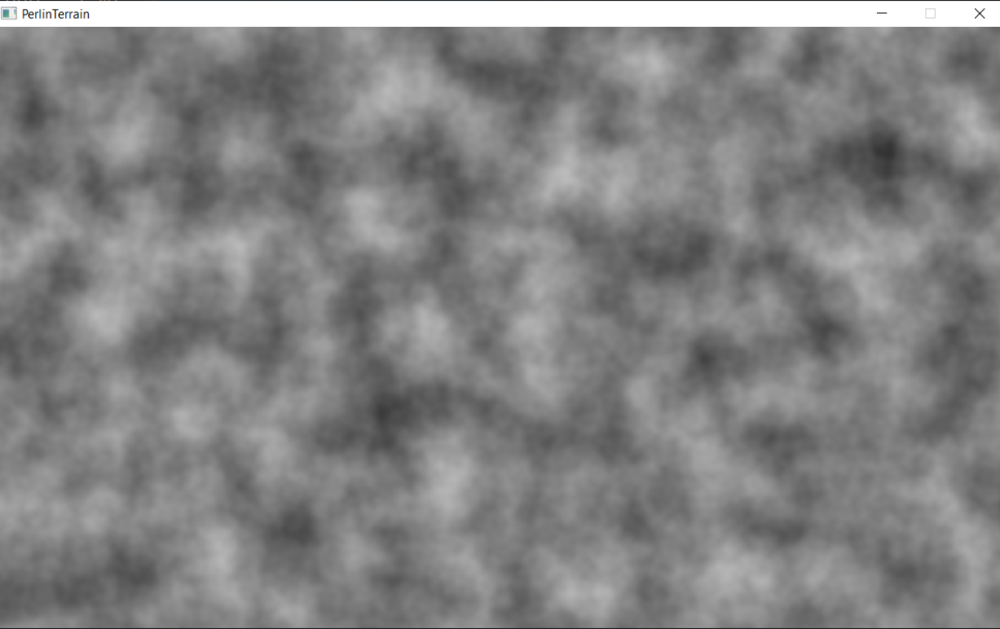
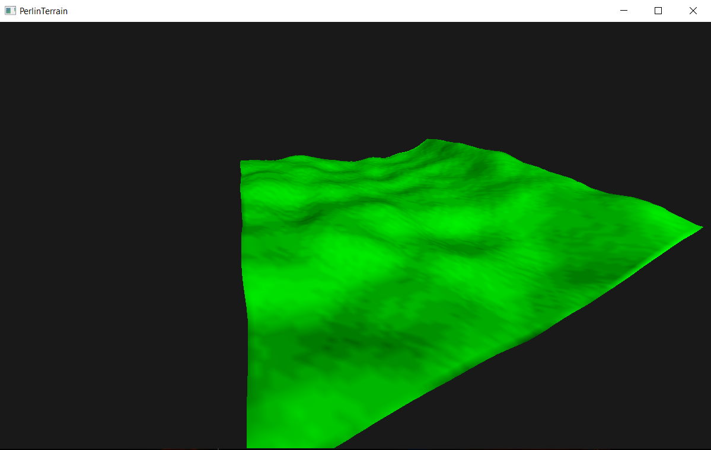

# PerlinTerrain
This is a test project which I made to play around with perlin noise for terrain generation.
Excuse me since I can't guarantee that the buildsystem is cross-platform (It was a test project so I didn't integrate a proper cross-platform buildsystem).

The language I am using is C and am rendering using OpenGL and GLFW. For perlin noise algorithm, 
I am using stb_perlin since it is quite a popular single header library.

# Development environment
The platform I am using :-
 - Windows 10, 64-bit 
 - MinGW-W64 14.1.0
 - Buildsystem is Make

# Features
 - [x] Generated the heightmap using stb_perlin
 - [x] Rendered a small piece of flat terrain
 - [x] Used the data from the heightmap on the terrain's vertices
 - [x] Generated the surface normal for each triangle of the terrain and did some diffuse lighting
 - [ ] Make the terrain infinite

# Glimpses

